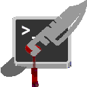

# stabbed 
stabbed is a very simple script invoking [suckless](https://suckless.org/) [tabbed](https://tools.suckless.org/tabbed/) with [st](https://st.suckless.org/),
resulting in a terminal with tabs support built-in.
<br>
Patches and custom configuration are provided to achieve the desired behavior.

## Requirements
In order to build both tabbed and st, you need the Xlib header files.

## Patches
### tabbed
The following patch is applied to tabbed:
1. [drag](https://tools.suckless.org/tabbed/patches/drag/)

### st
A custom patch has been created, to work with latest master, combining the following patches:
1. [blinking cursor](https://st.suckless.org/patches/blinking_cursor/)
2. [bold is not bright](https://st.suckless.org/patches/bold-is-not-bright/)
3. [scrollback](https://st.suckless.org/patches/scrollback/)
3. [scrollback-ringbuffer](https://st.suckless.org/patches/scrollback/st-scrollback-ringbuffer-0.8.5.diff)
3. [scrollback-mouse](https://st.suckless.org/patches/scrollback/st-scrollback-mouse-20220127-2c5edf2.diff)
3. [scrollback-mouse-altscreen](https://st.suckless.org/patches/scrollback/st-scrollback-mouse-altscreen-20220127-2c5edf2.diff)
3. [universcroll](https://st.suckless.org/patches/universcroll/)

## Build
On first pull, we have to also pull suckless repos, so execute:
```
% git submodule update --init
```
Then, you can build everything using the provided makefile:
```
% make
```
This will first apply all patches and then build tabbed, st and stabbed inside project folder.

## Execution
To run stabbed, you have to first give the corresponding permissions to the script, and then execute it:
```
% chmod a+x stabbed
% ./stabbed
```

## Installation
To install the script into your system, simply execute:
```
% make install
```
If you also want to generate a .desktop file for the installed script, execute:
```
% make install-desktop
```
These commands will *NOT* install tabbed or st in your system, as the script uses the patched ones from the project folder.

## Usage
Stabbed is configured to use `zsh` as default shell.
<br>
You can use a different shell using `SHELL={shell}` make flag.
<br>
This is our custom key bindings configuration for stabbed:
| Key                 | Action                        |
|---------------------|-------------------------------|
| Ctrl+Shift+t        | Spawn new tab                 |
| Ctrl+PageUp         | Go to previous tab            |
| Ctrl+PageDown       | Go to next tab                |
| Ctrl+Shift+PageUp   | Move tab to previous position |
| Ctrl+Shift+PageDown | Move tab to next position     |
| Shift+PageUp        | Scroll up                     |
| Shift+PageDown      | Scroll down                   |
| Ctrl+Minus          | Zoom out                      |
| Ctrl+Shift+Plus     | Zoom in                       |

## Credits
Massive thanks to the suckless team for making software that sucks less.
<br>
Stabbed custom icon uses a vector kindly provided from List Heist.
